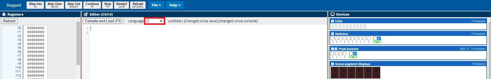
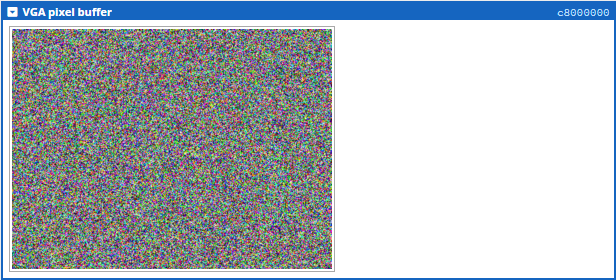
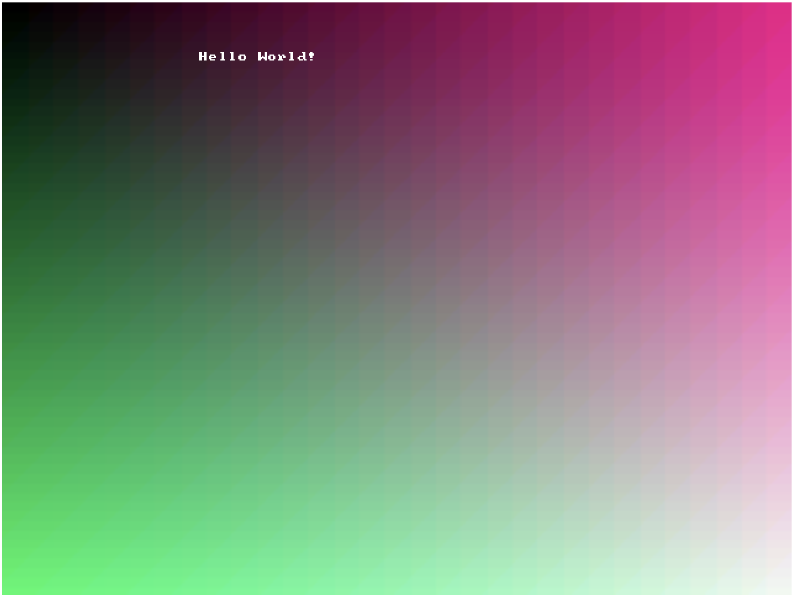
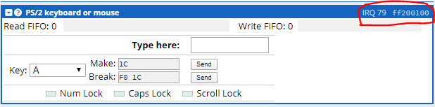
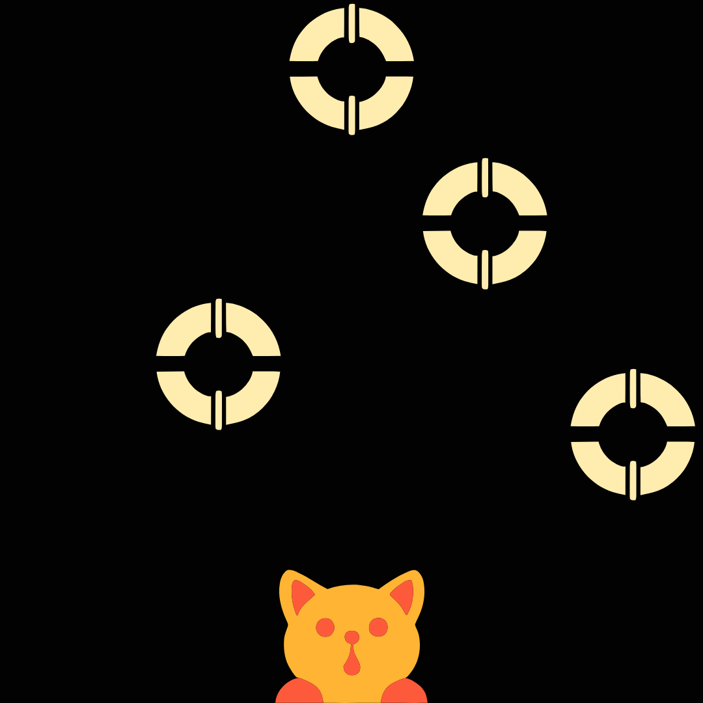
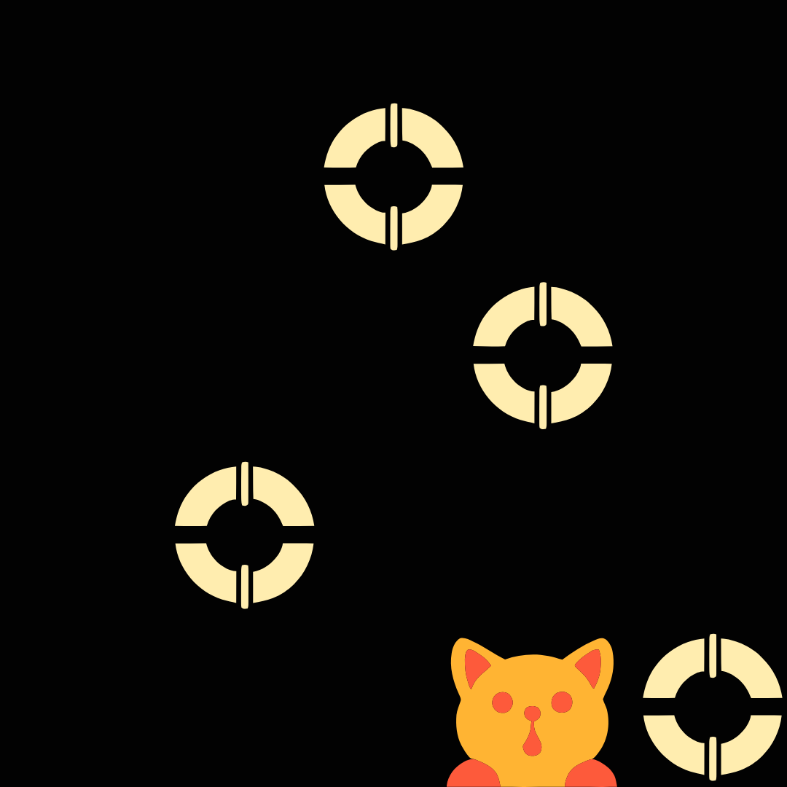

# Lab 4 : Escape from Assembly

This lab introduces the advanced I/O capabilities of the DE1-SoC computer, more specifically, the keyboard and the screen.
You will also learn to escape from assembly as most of this lab is to be done in C with inline assembly.
After writing assembly drivers that interface with memory, we will use the C functions to

1.  display pixels and characters using the VGA controller,
2.  accept keyboard input via the PS/2 port,
3.  create a fully functioning game.


For each of these topics, we will create a driver.
We will test the drivers both individually and in tandem by means of test applications. 

## Getting started

This lab requires students to use <a href="https://gcc.gnu.org/onlinedocs/gcc/extensions-to-the-c-language-family/how-to-use-inline-assembly-language-in-c-code.html">inline assembly</a> to access memory.
Inline assembly allows users to combine C language with assembly.
To get started, please make sure the language setup is configured as C rather than ARMv7.



Also please ensure that you are using the `HTTPS` protocol when accessing the simulator otherwise you will receive a server error when compiling.
Here is the `HTTPS` url: [https://ecse324.ece.mcgill.ca/simulator/?sys=arm-de1soc](https://ecse324.ece.mcgill.ca/simulator/?sys=arm-de1soc)

This is an example of using ARM assembly with C.
``` c
int foo(int x){
	int y = 0;
	__asm__ __volatile__(
		"add %0, %1, %2"     // %0, %1, and %2 are linked to output and input operands. y = x + 10.
        :"=r"(y)             // Output operands: %0
        :"r"(x), "r"(10)     // Input operands: %1, %2
		:"r1"                // Clobbers
	);
	return y;
}

int main() {
	int x = 0;	
	printf("Before inline assembly: x = %d\n", x);
	__asm__ __volatile__(
		"mov r0, %0\n\t"    // \n\t is newline in assembly and required for each line.
		"bl foo\n\t"		// Call function foo. Note that it automatically uses r0 as the argument registers.
		"mov %0, r0"	    // r0 is used as the result registers.
        :"+r"(x)            // output operands: %0 ('+' instead of '=' here means it can be also used as input.)
	);
	printf("Final result: x = %d\n", x);
	return x;
}	
```
## Task 0: Read/Write Byte/Halfword/Word in ARM Assembly

### Objective
Implement inline assembly functions in C to read and write a byte, halfword, or word at a specified address using inline ARM assembly.

### Function Prototypes

Define the function prototypes for reading and writing a byte, halfword, and word.
These functions will use inline assembly in ARM to perform the operations.

```c
// Reads a byte from a specific memory address
char read_byte(unsigned int address);

// Writes a byte to a specific memory address
void write_byte(unsigned int address, char value);

// Reads a halfword (2 bytes) from a specific memory address
short read_halfword(unsigned int address);

// Writes a halfword (2 bytes) to a specific memory address
void write_halfword(unsigned int address, short value);

// Reads a word (4 bytes) from a specific memory address
int read_word(unsigned int address);

// Writes a word (4 bytes) to a specific memory address
void write_word(unsigned int address, int value);
```
### Description of Each Function

- `read_byte(unsigned int address)`: Reads an 8-bit byte from the specified address.
- `write_byte(unsigned int address, char value)`: Writes an 8-bit byte to the specified address.
- `read_halfword(unsigned int address)`: Reads a 16-bit halfword from the specified address.
- `write_halfword(unsigned int address, short value)`: Writes a 16-bit halfword to the specified address.
- `read_word(unsigned int address)`: Reads a 32-bit word from the specified address.
- `write_word(unsigned int address, int value)`: Writes a 32-bit word to the specified address.

### Inline Assembly Usage
Each function will use ARM inline assembly to directly read from or write to the specified address.
You will need to create these functions to do tasks 1, 2 and 3.


# ⚠️ **WARNING: Only C Code is Allowed Beyond This Point!** ⚠️
All content and examples below must adhere strictly to C programming language conventions.
No assembly / inline assembly is allowed after this point. Use the task 0 functions to read/write to memory when needed.


## Task 1: Drawing things with VGA 

The DE1-SoC computer has a built-in VGA controller that can render
pixels, characters or a combination of both. The authoritative resource
on these matters is Sections 4.2.1 and 4.2.4 of the
<a href="./docs/DE1-SoC_Computer_ARM.pdf">DE1-SOC Computer Manual</a>.
This section of the lab provides a quick overview that should suffice
for the purpose of completing this lab.

To render pixels, the VGA controller continuously reads the *pixel
buffer,* a region in memory starting at `0xc8000000` that contains
the color value of every pixel on the screen. Colors are encoded as
16-bit integers that reserve 5 bits for the red channel, 6 bits for the
green channel and 5 bits for the blue channel. That is, every 16-bit
color is encoded like so:

|15 \... 11 |10 \... 5    |4 \... 0   |
|-----------|-------------|-----------|
|Red        |Green        |Blue       |

The pixel buffer is 320 pixels wide and 240 pixels high. Individual
pixel colors can be accessed at `0xc8000000 | (y << 10) | (x << 1)`, where `x` and `y`
are valid x and y coordinates.

As previously hinted, we can also render characters. To do so, we will
use the *character buffer,* which is analogous to the pixel buffer, but
for characters. The device's VGA controller continuously reads the
character buffer and renders its contents as characters in a built-in
font. The character buffer itself is a buffer of byte-sized ASCII
characters at `0xc9000000`. The buffer's has a width of 80
characters and a height of 60 characters. An individual character can be
accessed at `0xc9000000 | (y << 7) | x`.

### Create a VGA driver


To provide a slightly higher-level layer over the primitive
functionality offered by the pixel and character buffers, we will create
a driver. That is, a set of functions that can be used to control the
screen.

To help get you started, we created an application that uses such
functions to draw a testing screen. Your job is to create a set of
driver functions to support the application. Download
[task1.c](./src/task1.c) and augment it with the following four
functions:

-   `VGA_draw_point` draws a point on the screen with the
    color as indicated in the third argument, by accessing only the
    pixel buffer memory. **Hint:** This subroutine should only access
    the pixel buffer memory.
-   `VGA_clear_pixelbuff` clears (sets to 0) all the valid
    memory locations in the pixel buffer. It takes no arguments and
    returns nothing. **Hint:** You can implement this function by
    calling `VGA_draw_point` with a color value of zero for
    every valid location on the screen.
-   `VGA_write_char` writes the ASCII code passed in the third
    argument (r2) to the screen at the (x, y) coordinates given in the
    first two arguments (r0 and r1). Essentially, the subroutine will
    store the value of the third argument at the address calculated with
    the first two arguments. The subroutine should check that the
    coordinates supplied are valid, i.e., x in \[0, 79\] and y in \[0,
    59\]. **Hint:** This subroutine should only access the character
    buffer memory.
-   `VGA_clear_charbuff` clears (sets to 0) all the valid
    memory locations in the character buffer. It takes no arguments and
    returns nothing. **Hint:** You can implement this function by
    calling `VGA_write_char` with a character value of zero
    for every valid location on the screen.

Their C signatures are as follows:

``` c
void VGA_draw_point(int x, int y, short c);
void VGA_clear_pixelbuff(); 
void VGA_write_char(int x, int y, char c); 
void VGA_clear_charbuff();
``` 

**Notes:**

-   Use byte and halfword memory access in order to read/modify the bytes/half-words of the  memory contents.

### Testing the VGA driver 

To test your VGA driver, run your finished [task1.c](./src/task1.c). 
You should modify the parts highlighted with `TODO`.
You can inspect the VGA output visually using the VGA pixel buffer tab under the
Devices panel of the simulator.




If you implemented your driver correctly, compiling and running the
program will draw the following image.




## Task 2 : Create a PS/2 driver

###  Reading keyboard input 

For the purpose of this lab, here's a high level description of the PS/2
keyboard protocol. For a more comprehensive resource, see Section 4.5
(pp. 24-25) of the
<a href="./docs/DE1-SoC_Computer_ARM.pdf">DE1-SOC Computer Manual</a>.

The PS/2 bus provides data about keystroke events by sending hexadecimal
numbers called **scan codes**, which for this lab will vary from 1-3
bytes in length. When a key on the PS/2 keyboard is pressed, a unique
scan code called the **make code** is sent, and when the key is
released, another scan code called the **break code** is sent. The scan
code set used in this lab is summarized by the table below. (Originally
taken from Baruch Zoltan Francisc's <a href="http://users.utcluj.ro/~baruch/sie/labor/PS2/Scan_Codes_Set_2.htm">page on PS/2 scan codes</a>.

<table style="width:94%;">
<colgroup>
<col style="width: 6%" />
<col style="width: 7%" />
<col style="width: 8%" />
<col style="width: 8%" />
<col style="width: 8%" />
<col style="width: 10%" />
<col style="width: 10%" />
<col style="width: 5%" />
<col style="width: 9%" />
<col style="width: 8%" />
<col style="width: 10%" />
</colgroup>
<tbody>
<tr class="odd">
<td><strong>KEY</strong></td>
<td><strong>MAKE</strong></td>
<td><strong>BREAK</strong></td>
<td></td>
<td><strong>KEY</strong></td>
<td><strong>MAKE</strong></td>
<td><strong>BREAK</strong></td>
<td></td>
<td><strong>KEY</strong></td>
<td><strong>MAKE</strong></td>
<td><strong>BREAK</strong></td>
</tr>
<tr class="even">
<td><code>A</code></td>
<td><code>1C</code></td>
<td><code>F0,1C</code></td>
<td></td>
<td><code>9</code></td>
<td><code>46</code></td>
<td><code>F0,46</code></td>
<td></td>
<td><code>[</code></td>
<td><code>54</code></td>
<td><code>FO,54</code></td>
</tr>
<tr class="odd">
<td><code>B</code></td>
<td><code>32</code></td>
<td><code>F0,32</code></td>
<td></td>
<td><code>&#96;</code></td>
<td><code>0E</code></td>
<td><code>F0,0E</code></td>
<td></td>
<td><code>INSERT</code></td>
<td><code>E0,70</code></td>
<td><code>E0,F0,70</code></td>
</tr>
<tr class="even">
<td><code>C</code></td>
<td><code>21</code></td>
<td><code>F0,21</code></td>
<td></td>
<td><code>-</code></td>
<td><code>4E</code></td>
<td><code>F0,4E</code></td>
<td></td>
<td><code>HOME</code></td>
<td><code>E0,6C</code></td>
<td><code>E0,F0,6C</code></td>
</tr>
<tr class="odd">
<td><code>D</code></td>
<td><code>23</code></td>
<td><code>F0,23</code></td>
<td></td>
<td><code>=</code></td>
<td><code>55</code></td>
<td><code>FO,55</code></td>
<td></td>
<td><code>PG UP</code></td>
<td><code>E0,7D</code></td>
<td><code>E0,F0,7D</code></td>
</tr>
<tr class="even">
<td><code>E</code></td>
<td><code>24</code></td>
<td><code>F0,24</code></td>
<td></td>
<td><code>\</code></td>
<td><code>5D</code></td>
<td><code>F0,5D</code></td>
<td></td>
<td><code>DELETE</code></td>
<td><code>E0,71</code></td>
<td><code>E0,F0,71</code></td>
</tr>
<tr class="odd">
<td><code>F</code></td>
<td><code>2B</code></td>
<td><code>F0,2B</code></td>
<td></td>
<td><code>BKSP</code></td>
<td><code>66</code></td>
<td><code>F0,66</code></td>
<td></td>
<td><code>END</code></td>
<td><code>E0,69</code></td>
<td><code>E0,F0,69</code></td>
</tr>
<tr class="even">
<td><code>G</code></td>
<td><code>34</code></td>
<td><code>F0,34</code></td>
<td></td>
<td><code>SPACE</code></td>
<td><code>29</code></td>
<td><code>F0,29</code></td>
<td></td>
<td><code>PG DN</code></td>
<td><code>E0,7A</code></td>
<td><code>E0,F0,7A</code></td>
</tr>
<tr class="odd">
<td><code>H</code></td>
<td><code>33</code></td>
<td><code>F0,33</code></td>
<td></td>
<td><code>TAB</code></td>
<td><code>0D</code></td>
<td><code>F0,0D</code></td>
<td></td>
<td><code>U ARROW</code></td>
<td><code>E0,75</code></td>
<td><code>E0,F0,75</code></td>
</tr>
<tr class="even">
<td><code>I</code></td>
<td><code>43</code></td>
<td><code>F0,43</code></td>
<td></td>
<td><code>CAPS</code></td>
<td><code>58</code></td>
<td><code>F0,58</code></td>
<td></td>
<td><code>L ARROW</code></td>
<td><code>E0,6B</code></td>
<td><code>E0,F0,6B</code></td>
</tr>
<tr class="odd">
<td><code>J</code></td>
<td><code>3B</code></td>
<td><code>F0,3B</code></td>
<td></td>
<td><code>L SHFT</code></td>
<td><code>12</code></td>
<td><code>FO,12</code></td>
<td></td>
<td><code>D ARROW</code></td>
<td><code>E0,72</code></td>
<td><code>E0,F0,72</code></td>
</tr>
<tr class="even">
<td><code>K</code></td>
<td><code>42</code></td>
<td><code>F0,42</code></td>
<td></td>
<td><code>L CTRL</code></td>
<td><code>14</code></td>
<td><code>FO,14</code></td>
<td></td>
<td><code>R ARROW</code></td>
<td><code>E0,74</code></td>
<td><code>E0,F0,74</code></td>
</tr>
<tr class="odd">
<td><code>L</code></td>
<td><code>4B</code></td>
<td><code>F0,4B</code></td>
<td></td>
<td><code>L GUI</code></td>
<td><code>E0,1F</code></td>
<td><code>E0,F0,1F</code></td>
<td></td>
<td><code>NUM</code></td>
<td><code>77</code></td>
<td><code>F0,77</code></td>
</tr>
<tr class="even">
<td><code>M</code></td>
<td><code>3A</code></td>
<td><code>F0,3A</code></td>
<td></td>
<td><code>L ALT</code></td>
<td><code>11</code></td>
<td><code>F0,11</code></td>
<td></td>
<td><code>KP /</code></td>
<td><code>E0,4A</code></td>
<td><code>E0,F0,4A</code></td>
</tr>
<tr class="odd">
<td><code>N</code></td>
<td><code>31</code></td>
<td><code>F0,31</code></td>
<td></td>
<td><code>R SHFT</code></td>
<td><code>59</code></td>
<td><code>F0,59</code></td>
<td></td>
<td><code>KP *</code></td>
<td><code>7C</code></td>
<td><code>F0,7C</code></td>
</tr>
<tr class="even">
<td><code>O</code></td>
<td><code>44</code></td>
<td><code>F0,44</code></td>
<td></td>
<td><code>R CTRL</code></td>
<td><code>E0,14</code></td>
<td><code>E0,F0,14</code></td>
<td></td>
<td><code>KP -</code></td>
<td><code>7B</code></td>
<td><code>F0,7B</code></td>
</tr>
<tr class="odd">
<td><code>P</code></td>
<td><code>4D</code></td>
<td><code>F0,4D</code></td>
<td></td>
<td><code>R GUI</code></td>
<td><code>E0,27</code></td>
<td><code>E0,F0,27</code></td>
<td></td>
<td><code>KP +</code></td>
<td><code>79</code></td>
<td><code>F0,79</code></td>
</tr>
<tr class="even">
<td><code>Q</code></td>
<td><code>15</code></td>
<td><code>F0,15</code></td>
<td></td>
<td><code>R ALT</code></td>
<td><code>E0,11</code></td>
<td><code>E0,F0,11</code></td>
<td></td>
<td><code>KP EN</code></td>
<td><code>E0,5A</code></td>
<td><code>E0,F0,5A</code></td>
</tr>
<tr class="odd">
<td><code>R</code></td>
<td><code>2D</code></td>
<td><code>F0,2D</code></td>
<td></td>
<td><code>APPS</code></td>
<td><code>E0,2F</code></td>
<td><code>E0,F0,2F</code></td>
<td></td>
<td><code>KP .</code></td>
<td><code>71</code></td>
<td><code>F0,71</code></td>
</tr>
<tr class="even">
<td><code>S</code></td>
<td><code>1B</code></td>
<td><code>F0,1B</code></td>
<td></td>
<td><code>ENTER</code></td>
<td><code>5A</code></td>
<td><code>F0,5A</code></td>
<td></td>
<td><code>KP 0</code></td>
<td><code>70</code></td>
<td><code>F0,70</code></td>
</tr>
<tr class="odd">
<td><code>T</code></td>
<td><code>2C</code></td>
<td><code>F0,2C</code></td>
<td></td>
<td><code>ESC</code></td>
<td><code>76</code></td>
<td><code>F0,76</code></td>
<td></td>
<td><code>KP 1</code></td>
<td><code>69</code></td>
<td><code>F0,69</code></td>
</tr>
<tr class="even">
<td><code>U</code></td>
<td><code>3C</code></td>
<td><code>F0,3C</code></td>
<td></td>
<td><code>F1</code></td>
<td><code>05</code></td>
<td><code>F0,05</code></td>
<td></td>
<td><code>KP 2</code></td>
<td><code>72</code></td>
<td><code>F0,72</code></td>
</tr>
<tr class="odd">
<td><code>V</code></td>
<td><code>2A</code></td>
<td><code>F0,2A</code></td>
<td></td>
<td><code>F2</code></td>
<td><code>06</code></td>
<td><code>F0,06</code></td>
<td></td>
<td><code>KP 3</code></td>
<td><code>7A</code></td>
<td><code>F0,7A</code></td>
</tr>
<tr class="even">
<td><code>W</code></td>
<td><code>1D</code></td>
<td><code>F0,1D</code></td>
<td></td>
<td><code>F3</code></td>
<td><code>04</code></td>
<td><code>F0,04</code></td>
<td></td>
<td><code>KP 4</code></td>
<td><code>6B</code></td>
<td><code>F0,6B</code></td>
</tr>
<tr class="odd">
<td><code>X</code></td>
<td><code>22</code></td>
<td><code>F0,22</code></td>
<td></td>
<td><code>F4</code></td>
<td><code>0C</code></td>
<td><code>F0,0C</code></td>
<td></td>
<td><code>KP 5</code></td>
<td><code>73</code></td>
<td><code>F0,73</code></td>
</tr>
<tr class="even">
<td><code>Y</code></td>
<td><code>35</code></td>
<td><code>F0,35</code></td>
<td></td>
<td><code>F5</code></td>
<td><code>03</code></td>
<td><code>F0,03</code></td>
<td></td>
<td><code>KP 6</code></td>
<td><code>74</code></td>
<td><code>F0,74</code></td>
</tr>
<tr class="odd">
<td><code>Z</code></td>
<td><code>1A</code></td>
<td><code>F0,1A</code></td>
<td></td>
<td><code>F6</code></td>
<td><code>0B</code></td>
<td><code>F0,0B</code></td>
<td></td>
<td><code>KP 7</code></td>
<td><code>6C</code></td>
<td><code>F0,6C</code></td>
</tr>
<tr class="even">
<td><code>0</code></td>
<td><code>45</code></td>
<td><code>F0,45</code></td>
<td></td>
<td><code>F7</code></td>
<td><code>83</code></td>
<td><code>F0,83</code></td>
<td></td>
<td><code>KP 8</code></td>
<td><code>75</code></td>
<td><code>F0,75</code></td>
</tr>
<tr class="odd">
<td><code>1</code></td>
<td><code>16</code></td>
<td><code>F0,16</code></td>
<td></td>
<td><code>F8</code></td>
<td><code>0A</code></td>
<td><code>F0,0A</code></td>
<td></td>
<td><code>KP 9</code></td>
<td><code>7D</code></td>
<td><code>F0,7D</code></td>
</tr>
<tr class="even">
<td><code>2</code></td>
<td><code>1E</code></td>
<td><code>F0,1E</code></td>
<td></td>
<td><code>F9</code></td>
<td><code>01</code></td>
<td><code>F0,01</code></td>
<td></td>
<td><code>]</code></td>
<td><code>5B</code></td>
<td><code>F0,5B</code></td>
</tr>
<tr class="odd">
<td><code>3</code></td>
<td><code>26</code></td>
<td><code>F0,26</code></td>
<td></td>
<td><code>F10</code></td>
<td><code>09</code></td>
<td><code>F0,09</code></td>
<td></td>
<td><code>;</code></td>
<td><code>4C</code></td>
<td><code>F0,4C</code></td>
</tr>
<tr class="even">
<td><code>4</code></td>
<td><code>25</code></td>
<td><code>F0,25</code></td>
<td></td>
<td><code>F11</code></td>
<td><code>78</code></td>
<td><code>F0,78</code></td>
<td></td>
<td><code>'</code></td>
<td><code>52</code></td>
<td><code>F0,52</code></td>
</tr>
<tr class="odd">
<td><code>5</code></td>
<td><code>2E</code></td>
<td><code>F0,2E</code></td>
<td></td>
<td><code>F12</code></td>
<td><code>07</code></td>
<td><code>F0,07</code></td>
<td></td>
<td><code>,</code></td>
<td><code>41</code></td>
<td><code>F0,41</code></td>
</tr>
<tr class="even">
<td><code>6</code></td>
<td><code>36</code></td>
<td><code>F0,36</code></td>
<td></td>
<td><p><code>PRNT</code></p>
<p><code>SCRN</code></p></td>
<td><p><code>E0,12,</code></p>
<p><code>E0,7C</code></p></td>
<td><p><code>E0,F0,</code></p>
<p><code>7C,E0,</code></p>
<p><code>F0,12</code></p></td>
<td></td>
<td><code>.</code></td>
<td><code>49</code></td>
<td><code>F0,49</code></td>
</tr>
<tr class="odd">
<td><code>7</code></td>
<td><code>3D</code></td>
<td><code>F0,3D</code></td>
<td></td>
<td><code>SCROLL</code></td>
<td><code>7E</code></td>
<td><code>F0,7E</code></td>
<td></td>
<td><code>/</code></td>
<td><code>4A</code></td>
<td><code>F0,4A</code></td>
</tr>
<tr class="even">
<td><code>8</code></td>
<td><code>3E</code></td>
<td><code>F0,3E</code></td>
<td></td>
<td><code>PAUSE</code></td>
<td><p><code>E1,14,77,</code></p>
<p><code>E1,F0,14,</code></p>
<p><code>F0,77</code></p></td>
<td></td>
<td></td>
<td></td>
<td></td>
<td></td>
</tr>
</tbody>
</table>

Two other parameters involved are the **typematic delay** and the
**typematic rate.** When a key is pressed, the corresponding make code
is sent, and if the key is held down, the same make code is repeatedly
sent at a constant rate after an initial delay. The initial delay
ensures that briefly pressing a key will not register as more than one
keystroke. The make code will stop being sent only if the key is
released or another key is pressed. The initial delay between the first
and second make code is called the typematic delay, and the rate at
which the make code is sent after this is called the typematic rate. The
typematic delay can range from 0.25 seconds to 1.00 second and the
typematic rate can range from 2.0 cps (characters per second) to 30.0
cps, with default values of 500 ms and 10.9 cps respectively.

The DE1-SoC receives keyboard input from a memory-mapped PS/2 data
register at address `0xff200100`. Said register has an
`RVALID` bit that states whether or not the current contents of
the register represent a new value from the keyboard. The `RVALID`
bit can be accessed by shifting the data register 15 bits to the right
and extracting the lowest bit, i.e.,
`RVALID = ((*(volatile int *)0xff200100) >> 15) & 0x1`. When
`RVALID` is true, the low eight bits of the PS/2 data register
correspond to a byte of keyboard data.

The hardware knows when you read a value from the memory-mapped PS/2
data register and will automatically present the next code when you read
the data register again.

For more details, see Section 4.5 (pp. 24-25) of the
<a href="./docs/DE1-SoC_Computer_ARM.pdf">DE1-SOC Computer Manual</a>.

Download [task2.c](./src/task2.c). You should modify the parts highlighted with `TODO`. 
This C file implements a
program that reads keystrokes from the keyboard and writes the PS/2
codes to the VGA screen using the character buffer. Copy your VGA driver
into `task2.c`. Then implement a function that adheres to the
following specifications:

-   **Name:** `read_PS2_data`
-   **Input argument** : A memory address in which the data that is
    read from the PS/2 keyboard will be stored (pointer argument).
-   **Output argument** : Integer that denotes whether the data read
    is valid or not.
-   **Description:** The subroutine will check the `RVALID` bit in
    the PS/2 Data register. If it is valid, then the data from the same
    register should be stored at the address in the pointer argument,
    and the subroutine should return 1 to denote valid data. If the
    `RVALID` bit is not set, then the subroutine should simply
    return 0.

`read_PS2_data`'s C declaration is as follows:

``` c
int read_PS2_data(char *data);
```

### Testing the PS/2 driver

To verify that the PS/2 driver is working correctly, you can type into
the simulator's PS/2 keyboard device and verify that the bytes showing
up on the screen correspond to the codes you might expect from the table
in this section's introduction.

If you implemented your PS/2 and VGA drivers correctly, then the program
will print make and break codes whenever you type in the simulator's
keyboard input device. Make sure to use the keyboard device that says
`ff200100`.



**Note:** If you did not manage to implement a working VGA driver, then
you can still get credit for the PS/2 driver by writing you PS/2 driver within [task2_v2.c](./src/task2_v2.c).

**Note:** Please submit either task2_v2.c or task2.c. Not both.

## TASK 3 - Putting everything together : Falling Objects Game
We will now create a falling objects game using C and your drivers from the previous tasks.
Objects fall from the top of the screen, and the player must catch them using a customly made character that moves horizontally at the bottom of the screen.
The game will incorporate randomness, scoring, and a game-over condition.

The screen is to be divided into a 5x5  grid.
The grid should not be visible to the user but it will be used to limit the location of the objects and character.


### Setting up the screen


To start, write a function (init_game) that initializes the game variables (like score, player position, game status) and sets up the screen or display. 

1.   Set up the initial player position in the middle of the bottom of the screen. 
2.   Set the initial score to zero. 
3.   Configure initial game settings, like the column layout and speed limits.
4.   Initialize character. You can draw your own character. Make sure it is clearly visible
5.   Initialize the background to the color that you want.

Make sure that the background and the character are clearly visible and distinguishible. Make sure that the size of the character does not exceed the size of the row.

You may want to write the following subroutines to help you with this task:

- Write a subroutine (VGA_fill) to fill the VGA panel with a solid color. The subroutine does not take any arguments. Hard code the background color.
- Write a subroutine (draw_character) to draw the character. The subroutine takes one argument i.e., the center coordinates (x) of the character. Hard code the mark color and size.


This is an example of the starting screen:

### Gameplay Mechanics:

At first the player should hit any keyboard button to start the game.

Then, objects fall from the top of the screen at random intervals and in random columns.
Use the pseudo-random number generator attached below to decide on :

- Which column each object falls from.
- The speed at which each object falls. 
- The wait time before a new object falls


```
// ----------------------- //
// Psuedo Number Generator //
// ----------------------- //

unsigned int seed = 12345;  // You can set this to any starting value

// Function to generate a pseudo-random number
unsigned int pseudo_random() {
    // LCG parameters (from Numerical Recipes)
    seed = (1103515245 * seed + 12345) & 0x7fffffff;
    return seed;
}

// Function to get a pseudo-random number within a specific range [min, max]
unsigned int random_in_range(int min, int max) {
    return (pseudo_random() % (max - min + 1)) + min;
}
	
```

You can test the pseudo-number generator using the code below:

```
#include <stdio.h>
int main() {
    // Example usage: Generate 10 random numbers between 1 and 5
    for (int i = 0; i < 10; i++) {
        printf("Random number %d: %u\n", i + 1, random_in_range(1, 5));
    }
    return 0;
}
```


Choose a minimum and maximum speed range to vary the difficulty. Additionally, allow a sufficient wait time between falling objects to allow the player to move to any position of the screen. The player should be able to achieve a score of at least 5 in the first 15 seconds of the game.


It would be advisable to create the following subroutines to implement this:

- Write a subroutine (draw_object) to draw the object that falls onto the player. The subroutine takes two arguments i.e., the center coordinates (x,y) of the object. Hard code the mark color and size.
- Write the subroutine (spawn_object) which creates a new falling object in a random column with a random speed at the top of the screen.    
  
    1. Randomly select a column for the object. 
    2. Assign a random speed within the defined minimum and maximum speed limits. 
    3. Call the `draw_object` function. Make sure that the object is clearly visible.

- Write the subroutine (update_objects) which
moves each active falling object downward based on its assigned speed.

    1.  It should update the y-position of each object on the screen and it should check if an object has reached the bottom of the screen.
    2.  If the object has reached the bottom of the screen, the object should be removed from the game
    3.  You may want to create a subroutine (erase_object) that erases the object from its current position on the screen.

The player controls the character’s horizontal movement to try to catch each falling object. You should create the following functions:

- Write a subroutine (update_character_position) that moves the character left or right depending on the keyboard input. If the character is at the edge of the screen, no movement should occur. You may want to create a subroutine (erase_character) that erases the character from the screen to implement this functionality.


This is an example of the game screen:


### Scoring System:

The player earns 1 point for each object successfully caught by positioning the character in the same column as the object when it reaches the bottom.

- Write a subroutine (check_collision) which checks if the player successfully catches a falling object. It should detect if the player’s position matches the position of any object that has reached the bottom.
- Write a subroutine (update_score) which increments the score whenever an object is caught.


If the player fails to catch an object (i.e., if it falls to the bottom without being caught), the game ends.



When the game ends, you should display the player’s final score.

- Write a subroutine (game_over) to write the result of the game on the display. The subroutine takes one argument i.e., the number of objects successfully picked up.
  


The player then can restart the game by hitting any button on the keyboard.


### Game Graphics

You are free to design your own graphics for the game.
All the images shown here are just for illustration purpose to give you an idea of how the game could look like.
If you wish to simply have a square for the falling object and another square for the catcher at the bottom of the screen, this is absolutely fine.
The score screen at the end can also use the same font size if you prefer.
You will not be marked on the appearance of your game, but only on it being playable and behaving according to the description here.


### Time

Your game will need a notion of time, to ensure that the block are falling at a regular controlled speed.

The best and most precise way to achieve this is to use the ARM private counter, as seen in the previous lab.
We suggest that you use polling when using the private counter to make your life easier (as opposed to using interrupts).
You can take inspiration from listing 1 in section 9.1 of the [DE1-SoC Computer manual](../lab3/docs/DE1-SoC_Computer_ARM.pdf) to see how you can poll the timer.

Using the private timer, you can implement the following C function:
```C
int timer_expired();
```
which will return 0 if the timer has not yet expired, and a non-zero value otherwise.
Then in your main game loop, you can check periodically if the timer have expired or not, and if this is the case, you can then update the position of the falling blocks.


### Deliverable

You are only allowed to use the task 0 functions and any functions written in purely C to implement your functionality.


## Submission and grading

Your submission will be graded based on your solutions to tasks 1 through 4.
The contribution of each task to the total grade is as below.
These percentages do not necessarily correlate to how challenging each task is.

  * Task 1: 20%
  * Task 2: 20%
  * Task 3: 60%


You should submit on myCourses and use one file per task, named as follows:
```
	* task1.c
	* task2.c
	* task3.c
```

The grading will be done by running your code manually and by checking that the behaviour is correct.


> **Important**: Note that we will check every submission for possible plagiarism. 
All suspected cases will be reported to the faculty. 
Please make sure to familiarize yourself with the course policies regarding academic integrity and remember that all the labs are to be done individually. 


